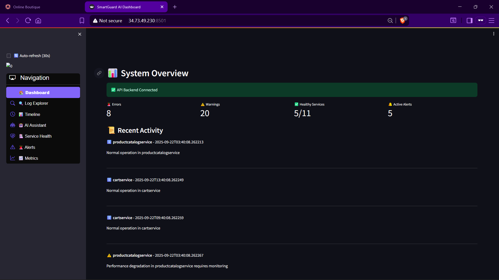
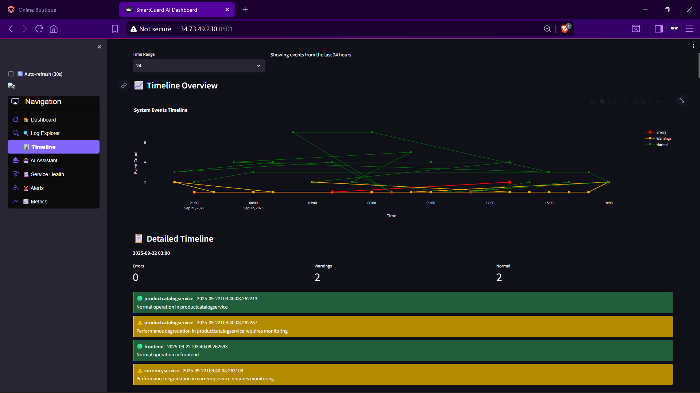
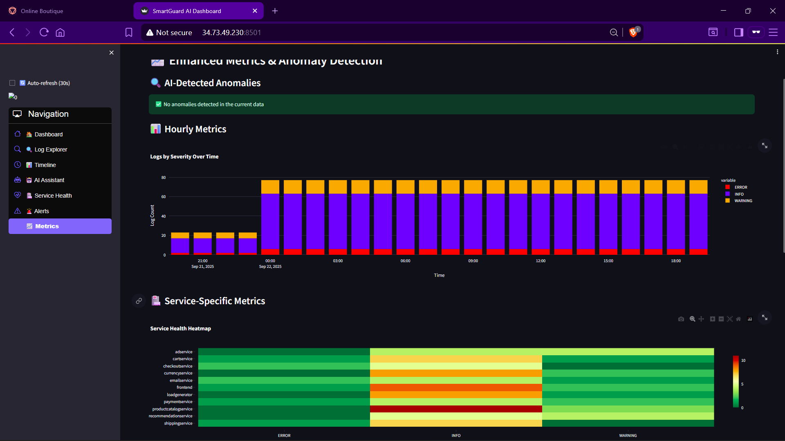
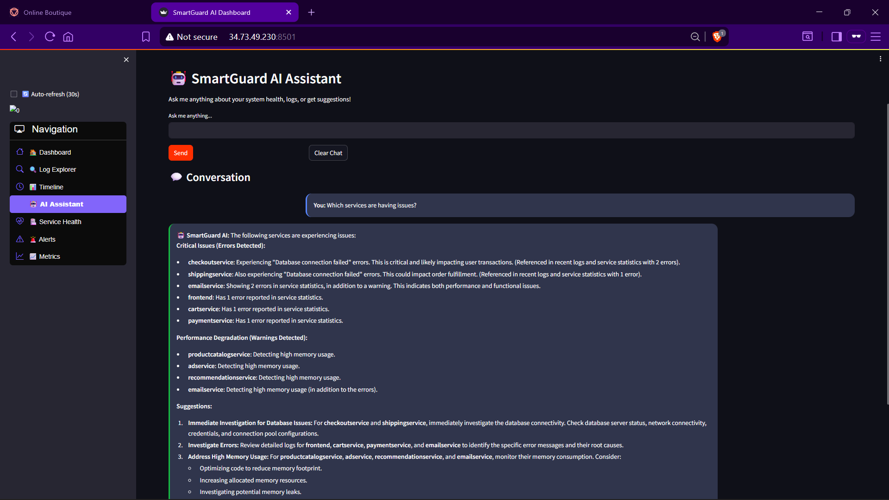

### SmartGuard AI Dashboard

[➡️ Jump to Local Setup](#option-a-run-with-docker-compose-recommended) • [☁️ Jump to GKE Cloud Shell Setup](#option-b-gke-cloud-shell-setup)

An AI-powered observability and alerting dashboard that analyzes logs, detects anomalies, and notifies your team in real-time. Built for speed during a hackathon, deployable locally or on GKE.

---
---

## Tech Stack

- FastAPI, Streamlit, SQLAlchemy, psycopg2
- PostgreSQL
- Google Gemini API, Google Cloud Logging
- Slack Webhooks
- Docker, Kubernetes (Minikube/GKE)

---

## Features

- **AI-driven log analysis and alerting**: Uses Gemini AI to summarize, search, and detect anomalies in logs.
- **Streamlit frontend + FastAPI backend**: Clean separation of concerns with a responsive UI.
- **PostgreSQL database**: Persists analyzed logs and insights for querying and dashboards.
- **Slack notifications integration**: Sends actionable alerts directly to your Slack channel.
- **GCP Logging Explorer integration**: Optional integration to pull real logs from Google Cloud.
- **Runs locally or on GKE**: Quick Docker Compose or Kubernetes manifests ready for Minikube/GKE.

---

## Architecture Diagram & Screenshots

- Architecture: [docs/architecture.md](docs/architecture.md) (Mermaid diagram)
## 📸 Screenshots





Components:
- Frontend (Streamlit)
- Backend (FastAPI)
- PostgreSQL
- Slack
- Gemini AI
- Kubernetes (Minikube/GKE)

---

## Reference Apps

- Monitored application (GKE): [GoogleCloudPlatform/microservices-demo](https://github.com/GoogleCloudPlatform/microservices-demo)
- This dashboard repo: [rahul6364/smartGuard-observability](https://github.com/rahul6364/smartGuard-observability)

---

## Local Setup

Choose one of the following options.

### Option A: Run with Docker Compose (recommended)

1) Prerequisites: Docker Desktop

2) Clone the repository
```bash
git clone https://github.com/rahul6364/smartGuard-observability
cd smartGuard-observability
```

3) Create a Service Account in Google Cloud:  
```bash
   - Go to [IAM & Admin → Service Accounts](https://console.cloud.google.com/iam-admin/serviceaccounts)  
   - Click **Create Service Account** → assign role **Logging Viewer**  
   - After creation → **Keys** → **Add Key** → **Create new key** → select **JSON**  
   - Download this file as `key.json` and place it in your project root
```

4) Create a `.env` file (optional; defaults exist in compose)

 Set environment variables
```bash
export GEMINI_API_KEY=your_gemini_key
export SLACK_WEBHOOK_URL=https://hooks.slack.com/services/XXX/YYY/ZZZ
export GOOGLE_APPLICATION_CREDENTIALS=$(pwd)/key.json   # path to your GCP key.json
export DB_HOST=localhost
export DB_PORT=5432
export DB_NAME=smartguard
export DB_USER=postgres
export DB_PASSWORD=password

 
```

4) Start the stack
```bash
docker compose up -d --build
```

5) Open in browser
- Frontend: `http://localhost:8501`
- Backend metrics: `http://localhost:8000/metrics`


### Option B: GKE Cloud Shell Setup

1) Open Cloud Shell and clone the repo

```bash
git clone https://github.com/rahul6364/smartGuard-observability
cd smartGuard-observability
```

2) Export environment variables
```bash
export PROJECT_ID=<your project id>
export REGION=us-central1
```
👉 For sg-secrets.yml
```bash
apiVersion: v1
kind: Secret
metadata:
  name: sg-secrets
  namespace: smartguard
type: Opaque
data:
  GEMINI_API_KEY: <base64-encoded-gemini-api-key>
  SLACK_WEBHOOK_URL: <base64-encoded-slack-webhook-url>
```
Encode like this:
```bash
echo -n "your-gemini-api-key" | base64
echo -n "https://hooks.slack.com/services/xxxx" | base64
```
👉 For sg-key.yml (Service Account Key.json)
```bash
apiVersion: v1
kind: Secret
metadata:
  name: sg-key
  namespace: smartguard
type: Opaque
data:
  GOOGLE_APPLICATION_CREDENTIALS.json: <base64-encoded-key-json>
```
Encode like this:
```bash
base64 key.json | tr -d '\n' > key.json.b64
```bash

3) Set the Google Cloud project and region and ensure the Google Kubernetes Engine API is enabled.

```bash  
  export PROJECT_ID=<PROJECT_ID>
export REGION=us-central1 
gcloud services enable container.googleapis.com \
  --project=${PROJECT_ID} 
```
  
4) Create a GKE cluster and get the credentials for it.

```bash
gcloud container clusters create smartguard \
    --project=${PROJECT_ID} \
    --region=us-east1 \
    --num-nodes=1 \
    --disk-size=20 \
    --machine-type=e2-medium
```

5) Apply Kubernetes manifests
```bash
kubectl apply -f k8s/sg-namespace.yml
kubectl apply -f k8s/
```
6) Wait for the pods to be ready.
```bash
kubectl get all -n smartguard
```

7) Get external IP for the frontend
```bash
kubectl get svc smartguard -n smartguard -o jsonpath='{.status.loadBalancer.ingress[0].ip}'
# Open http://<EXTERNAL-IP>:8501
```

---

## Notes

- Please provide your own:
  - **Gemini API key** (`GEMINI_API_KEY`)
  - **Slack webhook URL** (`SLACK_WEBHOOK_URL`)
  - **GCP service account key** (`key.json` for Logging Explorer)
- If keys are not provided, the app runs with mocked/sample data, so you can still demo the UI and flows.
- Do not commit sensitive keys. Use environment variables, Kubernetes Secrets, or local `.env` files excluded by `.gitignore`.

---


🏗️ Architecture

### Backend (FastAPI)
- **RESTful API**: Clean API endpoints for all dashboard features
- **AI Integration**: Google Gemini AI for natural language processing
- **Database Layer**: PostgreSQL with SQLAlchemy ORM
- **Real-time Data**: Live log processing and analysis

### Frontend (Streamlit)
- **Modern UI**: Clean, responsive design with custom CSS
- **Interactive Components**: Plotly charts, network graphs, and real-time updates
- **AI Chat Interface**: Conversational AI assistant
- **Multi-page Navigation**: Organized feature sections

### AI Features
- **Natural Language Processing**: Query interpretation and log analysis
- **Anomaly Detection**: Pattern recognition in system metrics
- **Smart Summarization**: AI-generated insights from raw data
- **Contextual Responses**: AI assistant with system awareness

## 📊 Dashboard Sections

### 🏠 Dashboard Overview
- Key system metrics at a glance
- Recent activity feed
- Health status summary
- Quick access to critical information

### 🔍 Log Explorer
- Natural language search interface
- AI-powered query interpretation
- Filtered results with AI summaries
- Quick search examples

### 📊 Timeline
- Interactive event timeline
- Visual event tracking
- Hourly event aggregation
- Detailed event inspection

### 🤖 AI Assistant
- Chat interface for system questions
- Context-aware responses
- Quick question buttons
- Conversation history

### 🏥 Service Health
- Microservice network visualization
- Health status indicators
- Error rate monitoring
- Service dependency mapping

### 🚨 Alerts
- Active alert management
- AI-generated incident reports
- Suggested actions
- Alert trend analysis

### 📈 Metrics
- Enhanced metrics with anomaly detection
- System health scoring
- Service performance heatmaps
- Historical trend analysis

🔮 Future Enhancements

- Machine learning model training on historical data
- Predictive analytics for system failures
- Integration with more monitoring tools
- Advanced visualization options
- Mobile-responsive design improvements
- Multi-tenant support
- Custom dashboard creation
- Advanced AI model fine-tuning

<!-- # 🛡️ SmartGuard AI Dashboard

A comprehensive AI-powered monitoring and observability dashboard for microservices, built with Streamlit and powered by Google Gemini AI.

## ✨ Unique Features

### 1. 🤖 AI-Powered Log Explorer
- **Natural Language Search**: Ask questions about your logs in plain English
- **Smart Query Interpretation**: AI understands context and applies appropriate filters
- **Intelligent Summarization**: Get AI-generated insights from raw log data
- **Example Queries**:
  - "Show me paymentservice errors in the last hour"
  - "Why did shippingservice fail yesterday?"
  - "Find all warnings related to database connections"

### 2. 📊 Interactive Incident Timeline
- **Visual Event Tracking**: Timeline view of system events with color-coded severity
- **Hourly Aggregation**: Events grouped by hour for better pattern recognition
- **Interactive Charts**: Hover and click to explore detailed event information
- **Real-time Updates**: Live timeline that refreshes automatically

### 3. 🤖 AI Assistant Panel
- **Chat Interface**: Conversational AI assistant for system health questions
- **Context-Aware Responses**: AI has access to recent logs and system status
- **Quick Questions**: Pre-built questions for common scenarios
- **Suggested Actions**: AI provides actionable recommendations

### 4. 🏥 Service Health View
- **Microservice Network Graph**: Visual representation of all 11 Online Boutique services
- **Health Status Indicators**: Color-coded nodes (🟢 Healthy, ⚠️ Warning, 🔴 Error)
- **Error Rate Monitoring**: Real-time error rate calculations
- **Service Dependencies**: Network visualization of service relationships

### 5. 🚨 Enhanced Alert Center
- **AI-Generated Incident Reports**: Smart summaries of alerts with root cause analysis
- **Suggested Fixes**: AI provides actionable recommendations for each alert
- **Alert Trends**: Historical view of alert patterns
- **Severity Classification**: Automatic categorization of alert severity

### 6. 📈 Advanced Metrics & Anomaly Detection
- **Anomaly Detection**: AI identifies unusual patterns in system behavior
- **Health Score**: Overall system health score (0-100) with visual gauge
- **Service Heatmaps**: Visual representation of service performance
- **Trend Analysis**: Historical metrics with spike detection

## 🚀 Quick Start

### Prerequisites
- Python 3.8+ OR Docker
- Google Cloud Platform account (for Gemini AI)
- Google Cloud Logging access (optional)

### Option 1: Docker Deployment (Recommended)

1. **Clone the repository**
```bash
git clone <repository-url>
cd smartguard-agent
```

2. **Set up environment variables**
Copy `env_template.txt` to `.env` and configure:
```env
GEMINI_API_KEY=your_gemini_api_key
GOOGLE_APPLICATION_CREDENTIALS=./key.json
```

3. **Start with Docker Compose**
```bash
docker-compose up -d
```

4. **Access the application**
- Backend API: http://localhost:8000
- Frontend Dashboard: http://localhost:8501

### Option 2: Development Mode

1. **Install dependencies**
```bash
# Backend dependencies
pip install -r backend/requirements.txt

# Frontend dependencies  
pip install -r frontend/requirements.txt
```

2. **Set up environment variables**
Create a `.env` file with your configuration

3. **Start both services**
```bash
python start_dev.py
```

### Option 3: Manual Start

1. **Start backend**
```bash
cd backend
python api.py
```

2. **Start frontend** (in another terminal)
```bash
cd frontend
streamlit run enhanced_dashboard.py
```

## 

## 🔧 Configuration

### API Endpoints
- `GET /logs` - Fetch logs with filters
- `POST /ai-search` - AI-powered log search
- `GET /timeline` - Incident timeline data
- `GET /service-health` - Service health status
- `POST /ai-chat` - AI assistant chat
- `GET /alerts` - Active alerts
- `GET /metrics-enhanced` - Enhanced metrics with anomalies

### Customization
- Modify service list in `api.py` for different microservices
- Adjust health thresholds in service health calculations
- Customize AI prompts for different analysis types
- Add new visualization types in dashboard sections

## 🤖 AI Capabilities

### Natural Language Processing
- Query interpretation and intent recognition
- Context-aware filtering and search
- Multi-language support for log analysis

### Anomaly Detection
- Statistical analysis of metrics
- Pattern recognition in time series data
- Automatic alert generation for anomalies

### Smart Summarization
- Log aggregation and summarization
- Root cause analysis
- Actionable recommendations

### Conversational AI
- System health questions
- Troubleshooting assistance
- Performance optimization suggestions

## 🚀 Deployment

### Docker Deployment
```bash
# Build the application
docker build -t smartguard-dashboard .

# Run with docker-compose
docker-compose up -d
```

### Production Considerations
- Use environment-specific configuration
- Set up proper database backups
- Configure monitoring and alerting
- Implement proper security measures
- Scale API and database as needed

## 📈 Monitoring & Observability

### Metrics Tracked
- Error rates by service
- Response times and latency
- Resource utilization
- System health scores
- Alert frequency and patterns

### AI Insights
- Anomaly detection results
- Root cause analysis
- Performance recommendations
- Predictive insights

## 🔒 Security

### Authentication
- API key-based authentication for Gemini AI
- Database connection security
- Environment variable protection

### Data Privacy
- Log data encryption
- Secure API communications
- GDPR compliance considerations

## 🤝 Contributing

1. Fork the repository
2. Create a feature branch
3. Make your changes
4. Add tests if applicable
5. Submit a pull request

## 📝 License

This project is licensed under the MIT License - see the LICENSE file for details.

## 🆘 Support

For support and questions:
- Create an issue in the repository
- Check the documentation
- Review the API endpoints
- Contact the development team

## 

---

**SmartGuard AI Dashboard** - Making microservices monitoring intelligent and accessible! 🛡️🤖 -->
