# SmartGuard AI Dashboard - Architecture Diagram

```mermaid
graph TB
    %% External Services
    GCP[Google Cloud Platform]
    GEMINI[Google Gemini AI API]
    SLACK[Slack Webhooks]
    
    %% User Interface
    USER[👤 User/DevOps Engineer]
    BROWSER[🌐 Web Browser]
    
    %% Frontend Layer
    STREAMLIT[📊 Streamlit Frontend<br/>Port 8501]
    
    %% Backend Layer
    FASTAPI[⚡ FastAPI Backend<br/>Port 8000]
    
    %% Database Layer
    POSTGRES[(🗄️ PostgreSQL<br/>Port 5432)]
    
    %% AI Processing
    AI_ENGINE[🤖 AI Processing Engine<br/>- Log Analysis<br/>- Anomaly Detection<br/>- Natural Language Processing]
    
    %% Monitoring Sources
    GCP_LOGS[📋 GCP Logging Explorer<br/>Real-time Logs]
    SAMPLE_DATA[📊 Sample Data<br/>Mock Logs for Demo]
    
    %% Container Orchestration
    DOCKER[🐳 Docker Compose<br/>Local Development]
    K8S[☸️ Kubernetes<br/>GKE/Minikube]
    
    %% Data Flow
    USER --> BROWSER
    BROWSER --> STREAMLIT
    STREAMLIT --> FASTAPI
    FASTAPI --> POSTGRES
    FASTAPI --> AI_ENGINE
    AI_ENGINE --> GEMINI
    AI_ENGINE --> GCP_LOGS
    AI_ENGINE --> SAMPLE_DATA
    FASTAPI --> SLACK
    
    %% Container Deployment
    DOCKER --> STREAMLIT
    DOCKER --> FASTAPI
    DOCKER --> POSTGRES
    
    K8S --> STREAMLIT
    K8S --> FASTAPI
    K8S --> POSTGRES
    
    %% Styling
    classDef frontend fill:#e1f5fe,stroke:#01579b,stroke-width:2px
    classDef backend fill:#f3e5f5,stroke:#4a148c,stroke-width:2px
    classDef database fill:#e8f5e8,stroke:#1b5e20,stroke-width:2px
    classDef ai fill:#fff3e0,stroke:#e65100,stroke-width:2px
    classDef external fill:#fce4ec,stroke:#880e4f,stroke-width:2px
    classDef container fill:#f1f8e9,stroke:#33691e,stroke-width:2px
    
    class STREAMLIT frontend
    class FASTAPI backend
    class POSTGRES database
    class AI_ENGINE,GEMINI ai
    class GCP,SLACK,GCP_LOGS external
    class DOCKER,K8S container
```

## Component Details

### Frontend Layer
- **Streamlit Dashboard** (Port 8501)
  - Interactive web interface
  - Real-time data visualization
  - AI chat interface
  - Multi-page navigation

### Backend Layer
- **FastAPI Server** (Port 8000)
  - RESTful API endpoints
  - Real-time log processing
  - Database operations
  - AI integration

### Database Layer
- **PostgreSQL** (Port 5432)
  - Log storage and retrieval
  - AI analysis results
  - System metrics history
  - User configurations

### AI Processing
- **Google Gemini AI**
  - Natural language processing
  - Log analysis and summarization
  - Anomaly detection
  - Contextual responses

### Data Sources
- **GCP Logging Explorer**
  - Real-time production logs
  - Microservices monitoring
  - Error tracking
- **Sample Data**
  - Mock logs for demo/testing
  - Simulated microservices behavior

### Deployment Options
- **Docker Compose** (Local Development)
  - Single-node deployment
  - Easy setup and testing
- **Kubernetes** (Production)
  - GKE (Google Kubernetes Engine)
  - Minikube (Local K8s)
  - Scalable and resilient

### External Integrations
- **Slack Webhooks**
  - Real-time alerts
  - Incident notifications
  - Team collaboration
